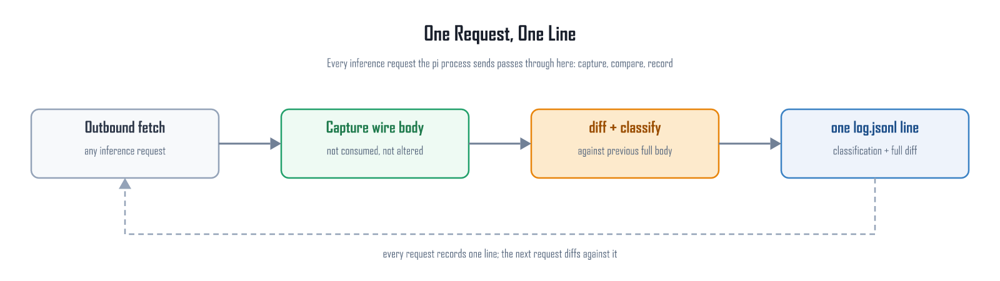
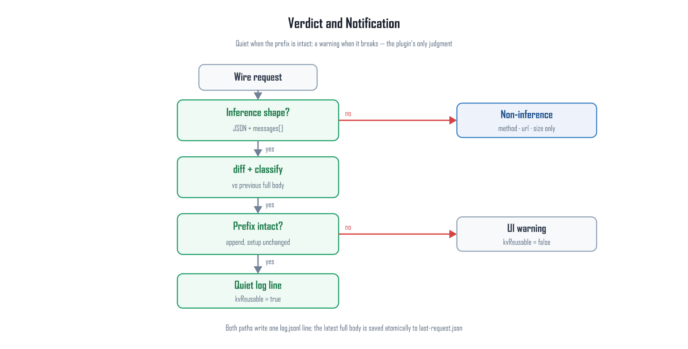

# prefix-sentinel

> Observation-only pi extension — a wire-layer prefix-integrity checker.
> No request mutation, no response touch, no tools added; it answers one question: **during the time you ran it, did the request prefix sent to the model framework ever change?**
>
> [中文](README.md)

## Why it exists

Whether a prompt / KV cache can be reused depends on whether the new request's prefix is identical to the previous one; any modification can invalidate the prefix cache. By design, pi's open ecosystem means the pi agent itself and some plugins may modify the prefix. This plugin exists to monitor such modifications: for every request actually sent, it captures the wire body (the exact bytes the provider receives) and diffs it in full against the previous one, pinning the change to a specific message.

## Features

- **Full coverage**: wraps the global `fetch` at the wire layer and observes every HTTP request the process sends — including those that bypass `before_provider_request` (pi's native compaction summary, direct `complete()` paths, subagents, …). Nothing slips past.
- **Pure observation**: requests pass through untouched; observation is fully decoupled from request fate. Zero runtime dependencies.
- **Verdict + notification**: prefix intact → one quiet log line; broken → UI warning, with `kvReusable` directly answering "does this request need a full prefill".
- **Bounded disk**: only the LATEST full body is kept (atomic overwrite); one log line per request, change regions never truncated.

## How it works

### The per-request rhythm



Every outbound request passes through the global `fetch` — the extension wraps it once per process (`/reload` only swaps in the observer). For inference-shaped requests (JSON with a `messages[]` array): capture the wire body (read via `clone()`, never consumed) → full-text diff + four-way prefix classification against the previous body → append one line to `log.jsonl` and atomically overwrite `last-request.json` with this body (the next request's baseline). Non-inference requests get a lightweight line (method/url/size) only; their bodies are not kept.

### Verdict and notification



Four-way prefix classification (longest common prefix of the message arrays, compared element-wise as JSON):

| classification | meaning |
| --- | --- |
| `append` | every previous message unchanged, pure tail extension — prefix intact |
| `prefix-changed` | a message inside the previous list changed — cache prefix broken |
| `rewind` | the new list is a strict prefix of the old one — context truncated |
| `branch` | the new list is shorter and diverges midway — context replaced |

**Prefix intact** = `append` with `tools` / `system` / `model` all unchanged (system is `messages[0]`); then `kvReusable: true` — the server only needs to prefill the new tail.

**Notification rules**: first request or no baseline → no warning; on a cross-process restart a brand-new context is expected (quiet) while a continued context that diverges, or a setup change, warns; within a process, `append` with unchanged setup stays quiet and any other change produces one UI warning. `modelChanged` is logged but not announced (switching models is usually intentional).

### Chain continuity

The baseline lives on disk (`last-request.json`), not in memory: the next request in the same process, or the first request of a **new process**, continues the chain from disk — pi restarts and `/reload` do not break it; the first log line of a new process carries `crossRestart: true`. Baselines from the older format are flagged `baselineIgnored: "legacy-format"` and the chain restarts from the current request, avoiding false alarms.

## Disk layout (`.pi/prefix-sentinel/`, per project cwd)

`last-request.json`: the latest wire body (`raw` exact bytes + `pretty` formatted copy), atomically overwritten per request, always exactly one; `log.jsonl`: one line per request, append-only, wipe anytime to restart the chain. `url` keeps host + path only (the query may carry credentials).

## log.jsonl fields

```jsonc
{
  "ts": 1789993868725,        // request timestamp
  "process": 1789993754463,   // this process's start time (cross-process marker)
  "index": 3,                 // request ordinal within this process
  "model": "…",               // taken from the request body
  "messages": 272,            // message count this request
  "tools": 19,                // tool count this request
  "prevIndex": 2,             // which request the baseline is
  "crossRestart": true,       // first line of a new process only
  "classification": "append", // append | prefix-changed | rewind | branch
  "commonPrefixMessages": 270,// longest common prefix (messages)
  "firstDivergentMessage": 270,// first divergent message index (prefix-changed/branch only)
  "toolsChanged": false,      // the three setup flags
  "systemChanged": false,
  "modelChanged": false,
  "kvReusable": true,         // append|rewind with setup unchanged
  "changed": false,           // classification != append or any setup change
  "diffOmittedContext": { "prefix": 260, "suffix": 3 }, // unchanged lines collapsed
  "diff": "  { …change region… }" // change region complete, context collapsed to counts
}
```

Non-inference requests are lightweight lines (`source: "other"`: method/url/bodyChars); the first request (no baseline) carries `"first": true`.

## Reliability

- **Requests always pass through untouched**: the wrapper calls the original `fetch` with identical arguments and returns its result; observation runs on a microtask queue where every step swallows its own failure — it can never delay, alter, or block a request.
- **Bodies are never consumed**: `Request` inputs are read via `clone()`; non-cloneable streams get a lightweight line only.
- **Disk failure degrades**: write failures fall back to in-memory observation without disturbing the flow.
- **Conservative verdicts**: based only on wire bytes and explicit setup fields; when the wire differs but tokens don't (e.g. `max_tokens`), the sentinel cannot know — it shows the full diff and lets you decide.

## Installation

```bash
git clone https://github.com/113636xfh/prefix-sentinel.git
pi install /path/to/prefix-sentinel
```

or drop `index.ts` into your project's `.pi/extensions/`. No configuration; the chain starts with the next request and survives `/reload`.

## Known limitations

- Non-inference requests get lightweight lines only (no bodies) — they do not join the prefix chain.
- Requests aborted before `fetch` (e.g. the provider ignored a custom fetch) never reached the server and correctly never enter the chain.
- Only the latest full body is kept on disk; history lives in `log.jsonl` diffs and classifications (change regions complete, context collapsed).
- Verdicts are text-level: provider-side tokenization differences are invisible — but identical wire bytes imply an identical token sequence, so that direction is reliable.

## License

MIT — see [LICENSE](LICENSE)
