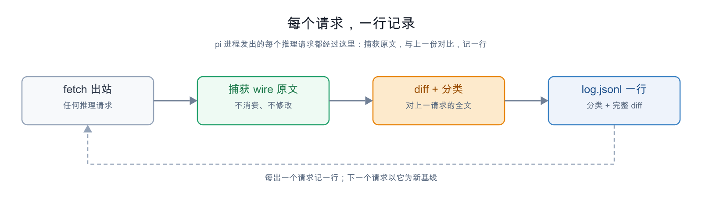
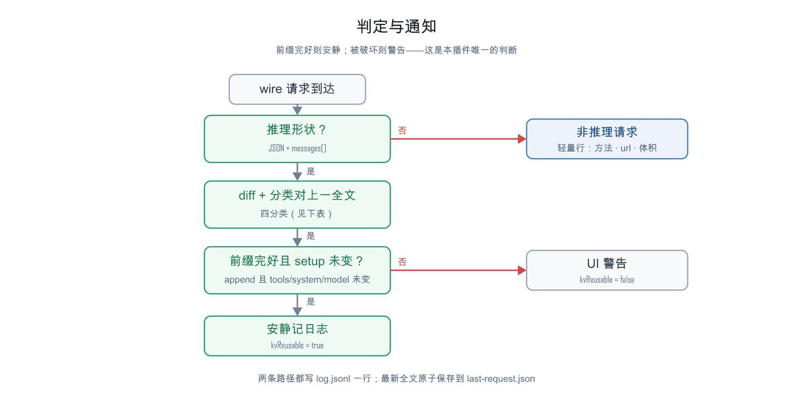

# prefix-sentinel

> 只观测的 pi 扩展 —— wire 层前缀一致性检查器。
> 不改请求、不动响应、不加工具；只回答一个问题：**这段时间里，发给模型框架的请求前缀有没有变？**
>
> [English](README.en.md)

## 为什么需要它

prompt / KV cache 能否复用，取决于新请求的前缀是否与旧请求相同；任何改动都可能使前缀缓存失效。pi 的设计与开放生态注定了：pi agent 本身和某些插件都可能修改前缀。本插件的目的就是监测这类修改：对每个实际发出的请求取 wire 原文（provider 真正收到的字节序列），与上一份全文 diff，把变化定位到具体消息。

## 特性

- **全量覆盖**：wire 层包装全局 `fetch`，观测进程发出的每个 HTTP 请求——包括绕过 `before_provider_request` 的（原生压缩摘要、`complete()` 直连、子代理……），无一漏网。
- **纯观测**：请求原样放行，观测与请求成败完全解耦；零运行时依赖。
- **判定 + 通知**：前缀完好 → 安静记一行；被破坏 → UI 警告，`kvReusable` 回答“是否需要全量 prefill”。
- **有界磁盘**：全文只留最新一份（原子覆盖）；日志每请求一行，变更区永不截断。

## 工作原理

### 每个请求的观测节奏



每个出站请求都经过全局 `fetch`——扩展每进程包一层（`/reload` 仅换观测器）。推理形状（JSON 且含 `messages[]`）的请求：捕获 wire 原文（`Request` 经 `clone()` 读取，不被消费）→ 与上一份全文 diff + 前缀四分类 → `log.jsonl` 记一行，`last-request.json` 原子覆盖为本次全文（下一个请求的基线）。非推理请求只记轻量行（method/url/体积），正文不留。

### 判定与通知



前缀四分类（消息数组逐条 JSON 比较求最长公共前缀）：

| classification | 含义 |
| --- | --- |
| `append` | 旧列表逐条不变，尾部纯追加 —— 前缀完好 |
| `prefix-changed` | 旧列表内部某条变了 —— 缓存前缀被破坏 |
| `rewind` | 新列表是旧列表的严格前缀 —— 上下文被截断 |
| `branch` | 新列表更短且中途分叉 —— 上下文被替换 |

**前缀完好** = `append` 且 `tools` / `system` / `model` 均未变（system 即 `messages[0]`），此时 `kvReusable: true`——服务端只需 prefill 新尾部。

**通知规则**：首次请求或无基线 → 不警告；跨进程续链时全新上下文视为预期（安静），续接上下文分叉或 setup 变化才警告；同进程内 `append` 且 setup 未变安静，其余每次变更一条 UI 警告。`modelChanged` 只记录不警告（换模型通常是有意为之）。

### 链的连续性

基线在磁盘上（`last-request.json`），不在内存里：同一进程的下一个请求、或**新进程**的第一个请求都从磁盘续链——pi 重启、`/reload` 不断链；新进程首条日志带 `crossRestart: true`。旧版本基线格式不同，标记 `baselineIgnored: "legacy-format"` 后从当前请求重开链，避免误报。

## 磁盘布局（`.pi/prefix-sentinel/`，按项目 cwd）

`last-request.json`：最新一份 wire 全文（`raw` 逐字节原文 + `pretty` 格式化副本，每请求原子覆盖，恒有一份）；`log.jsonl`：每请求一行，只追加，可随时清空重开链。`url` 只保留 host + path（query 可能带凭据）。

## log.jsonl 字段

```jsonc
{
  "ts": 1789993868725,        // 本次请求时间
  "process": 1789993754463,   // 本进程启动时间（跨进程判别）
  "index": 3,                 // 本进程内请求序号
  "model": "…",               // 取自请求体
  "messages": 272,            // 本次消息数
  "tools": 19,                // 本次 tools 数
  "prevIndex": 2,             // 基线是哪个请求
  "crossRestart": true,       // 仅跨进程首条
  "classification": "append", // append | prefix-changed | rewind | branch
  "commonPrefixMessages": 270,// 最长公共前缀（消息数）
  "firstDivergentMessage": 270,// 首个分叉消息下标（仅 prefix-changed/branch）
  "toolsChanged": false,      // setup 三标志
  "systemChanged": false,
  "modelChanged": false,
  "kvReusable": true,         // append|rewind 且 setup 未变
  "changed": false,           // 分类≠append 或任一 setup 变化
  "diffOmittedContext": { "prefix": 260, "suffix": 3 }, // 折叠的未变行数
  "diff": "  { …完整变更区… }" // 变更区完整，未变上下文折叠为计数
}
```

非推理请求为轻量行（`source: "other"`：method/url/bodyChars）；首次请求行带 `"first": true`。

## 可靠性设计

- **请求永远原样放行**：包装层以相同参数调用原 `fetch`、原样返回结果；观测排队在微任务、每环节自吞失败——永不延迟、不改变、不阻断。
- **正文从不被消费**：`Request` 经 `clone()` 读取；不可克隆的流体只记轻量行。
- **磁盘故障降级**：写盘失败后转纯内存观测，不打扰流程。
- **判定保守**：只依据 wire 字节与显式 setup 字段；wire 有差异但 token 未变（如 `max_tokens`）时，把完整 diff 摆出来由你看。

## 安装

```bash
pi install /path/to/prefix-sentinel
```

或把 `index.ts` 放入项目 `.pi/extensions/`。无配置项；下一个请求开始记链，`/reload` 后自动续用。

## 已知限制

- 非推理请求只计轻量行、不留正文——不参与前缀链。
- fetch 之前就被中止的请求（如 provider 忽略自定义 fetch）未触达服务端，自然不进链——期望行为。
- 磁盘只留最新一份全文；历史以 `log.jsonl` 的 diff 与分类存在。
- 判定是文本层的：provider 端分词差异不可见——但 wire 字节相同即 token 序列相同，这个方向可靠。

## License

MIT — 见 [LICENSE](LICENSE)
